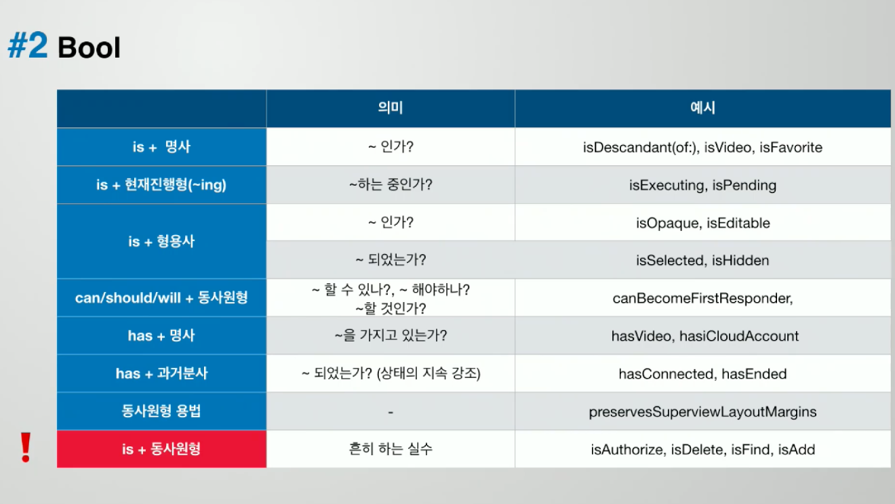

# 가위바위보 게임
> 프로젝트 기간 2022.04.18~2022.04.22 
> 팀원: @Groot-94(starting1231@naver.com), @yeton(lyeeun37@naver.com)
> 리뷰어: @Red

## step1 기능 구현
- UserChoice 타입 구현
- GameMessage 타입 구현
- GameResult 타입 구현
- RockPaperScissorsGame 타입 구현
- 메세지 출력 함수(printGameMessage)
- rawValue 추출 함수(convertUserChoiceToNumber)
- 게임 실행 함수(executeRockPaperScissors) : 게임실행에 필요한 함수들을 호출하는 함수
- 사용자의 입력을 받는 함수(inputUserSelect)
- 사용자의 입력값과 컴퓨터의 입력값 비교하는 함수(compareChoice)
    - 사용자의 입력(가위, 바위, 보)에 따라 비교하여 .win, .lose, .draw 를 반환하는 함수(compareToScissorsOfUser, compareToPaperOfUser, compareToRockOfUser)
- 게임결과를 출력하는 함수(printGameResult)
  
## 고민했던 것들

- 은닉화, 캡슐화의 기준
- 매직 넘버, 매직 스트링을 사용하지 않고 가독성을 위해 enum을 사용하는 방법의 장단점 
- 구조체에서 모든 것을 정의하는 방법의 장단점
- while문과 재귀호출의 차이점

## 배운 개념

- 열거형 rawValue에선 중복값이 불가능
- 열거형 rawValue에선 literal 사용불가, rawValue는 enum 자체를 수정하는 게 아닌이상 다른 방식으로 수정이 불가함
- switch문을 이용한 옵셔널 추출
- switch에서 비교하는 값이 case에 모두 해당되면 default를 사용하지 않는다
- if문에서의 함수호출
- enum을 사용하여 매직 넘버, 매직 스트링을 관리할 때 유지보수가 쉽다. 하지만, 가독성이 떨어질 수도 있다.
- 구조체와 클래스 모두 인스턴스를 선언 할 시 스택의 영역에 들어가게 된다. 하지만, 구조체는 스택의 영역에 값이 들어가고 클래스는 힙 영역에 값이 들어가고 그 주소값이 스택에 저장된다. 그렇기 때문에 클래스는 인스턴스를 상수로 선언해도 프로퍼티(변수)의 변경이 가능하다.
- 소스코드를 작성하면서 Foundation framework의 라이브러리를 사용하지 않고 swift 표준 라이브러리를 사용했기 때문에 적어주지 않아도 괜찮았다.
- 꼬리재귀 : 재귀함수 사용 시 추가연산을 하지않고 함수를 끝내는 것
    - 일반적인 재귀함수는 함수를 호출할 때 연산정보를 스택에 쌓으며 계산을 한다. 꼬리재귀를 사용하면 스택에 쌓지 않고 바로 다시 함수를 실행시키는 방법을 사용한다.
    - 조건 : 컴파일러가 최적화를 지원하는지 확인 후 사용해야 함
    - 컴파일러가 최적화를 지원하면 내부적으로는 재귀 함수를 반복문으로 변경되어 실행이 된다. 따라서, Stack Overflow 에 대한 위험이 없다고 하는 것이다.
    - 재귀함수를 사용해야 한다면 쓰는게 좋다? 반복문 VS 재귀 ?? 
```swift
에러상황

let timer = Timer()

정상

import Foundation

let timer = Timer() 
// Timer 함수는 Foundation에 포함되어 있기 때문에 import 하지 않으면 에러가 발생한다
```

## PR 후 개선사항

- convertUserChoiceToNumber 함수를 만들어서 사용한 이유는 enum에서 rawValue를 조금 더 간편하게 사용하려고 했으나, 리뷰를 받고나서 enum에서 프로퍼티를 꼭 case를 사용하는 방식이 아닌 static let을 사용해서 인스턴스 생성없이 바로 접근이 가능한 방법을 사용해서 수정
    - case가 없는 enum을 쓰면 순수하게 namespace로 사용이 가능하고, 뜻하지 않은 초기화를 막을 수 있다.
- 기존 구조체에 정의된 printGameMessage 함수를 제거하고 enum 안에서 rawValue를 사용하지 않고 printMessage 함수를 만들어서 원하는 메세지를 출력하도록 수정
- inputUserSelect 함수에서 불필요한 nil coalescing 사용을 제거
```swift=

변경 전 
userChoice = Int(readLine() ?? "") ?? 4

변경 후 
userChoice = Int(readLine() ?? "")

옵셔널 값을 비교하기 위해 switch 문을 사용하였기 때문에 옵셔널 추출이 필요하지 않았다
switch userChoice {
        case UserChoice.end,
            UserChoice.scissors,
            UserChoice.rock,
            UserChoice.paper:
            return true
        default:
            return false
        }
```

## step2 기능 구현
[ STEP2-1 ] 변수/열거형 추가

- enum에 새로운 메뉴 메시지 출력하는 case 추가
- 누구 턴인지 담아놓는 튜플형 전역변수 선언
 
[ STEP2-2 ] 입출력 함수 -> 초록색

- 메뉴 출력  (3)
- 사용자 입력 받음 (4)
- 그 입력이 유효한 지 검증(만들었던거 쓰면 됨) (5)
- 결과 출력하는 함수 

[ STEP2-3 ] 게임을 진행하는 함수   

- 사용자 턴인지 컴퓨터 턴인지 반환하는 함수 (2)
- 컴퓨터와 사용자 수 비교하는 함수 -> GameResult 반환
- 묵찌빠를 실행하는 함수 (1)
- 입력이 유효할 경우 묵찌빠 게임 시작하는 함수

## 고민했던 것들
- 연산 프로퍼티
```swift
enum GameRockPaperScissorsChoice: Int {
    case end = 0
    case scissors = 1
    case rock = 2
    case paper = 3
    case error
    
    var number: Int {
        get {
            return self.rawValue
        }
    }
}
```
`rawValue`를 코드상에서 직접적으로 쓰면 그 rawValue가 Int인지 String인지 사용자가 알 수 없기 때문에 가독성을 좋게 하기 위해서 rawValue를 number라는 이름으로 대체해주었다.
그러기 위해서 `enum(GameRockPaperScissorsChoice)` 안에서 연산 프로퍼티를 사용했다.

- Bool type으로 된 튜플의 네이밍에 대해 고민.

- 순서도만 보고 바로 코드로 구현한다음 어떻게 함수 단위로 분리할 것인지 고민.

 바로 짠 코드
```swift
func 묵찌빠게임시작() {
    var computernumber: Int
    var userTurn: Bool = true
    while true {
        print("1~3중에 입력하세요, 0은 종료")
        var userinput = Int(readLine()!)!    // 인풋받는거는 함수가 될 수 있음
        computernumber = Int.random(in: 1...3)  // 검증하는거도 함수가 될 수 있음
        if userinput >= 0 && userinput <= 3 { 
            if userTurn == true {
                if computernumber == userinput {
                    print("사용자 승리")
                    break
                } else {
                    userTurn = false
                }
            } else {
                if computernumber == userinput {
                    print("컴퓨터 승리")
                    break
                } else {
                    userTurn = true
                }
            }
        }
    }
}

묵찌빠게임시작()
```

- extension에서 저장프로퍼티를 사용할 수 없어서 연산프로퍼티를 사용해야하는데 어려움을 겪음.


## 배운 개념
- 연산 프로퍼티: 연산 프로퍼티는 실제로 값을 저장하지 않는 계산된 프로퍼티로, 다른 프로퍼티의 값을 getter을 이용해 간접적으로 값을 가져오고 setter을 이용해서 값을 설정하는 프로퍼티 입니다.

- Bool type으로 된 변수의 네이밍:

## PR 후 개선사항


## 순서도


